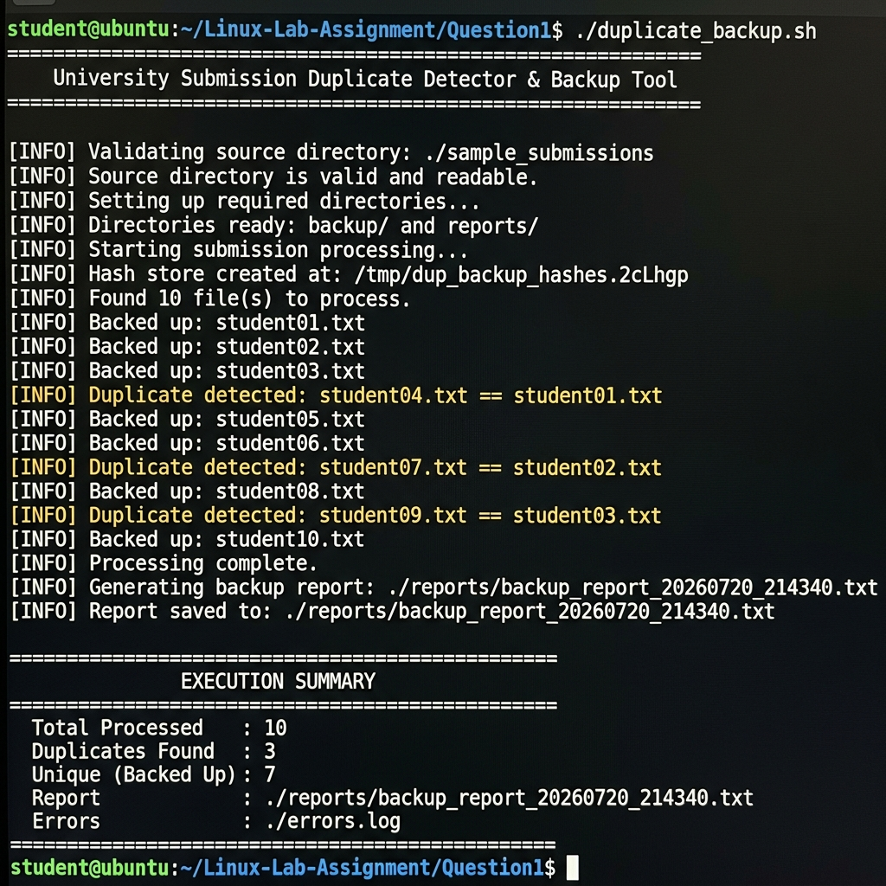
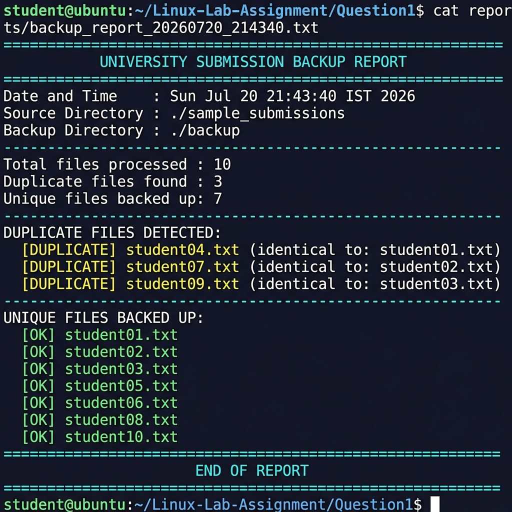

# Screenshots — Question 1
# Duplicate Detection & Backup Script

This folder contains **2 screenshots** captured from a real execution of `duplicate_backup.sh`.

---

## Screenshot 1 — Script Execution (Duplicate Detection)

**File:** `Screenshot-01-script-execution.png`



**What it shows:**
- The `duplicate_backup.sh` script being run with `./duplicate_backup.sh`
- `[INFO] Found 10 file(s) to process` — all 10 student submissions found
- `[INFO] Backed up: student01.txt` through `student10.txt` — unique files saved
- `[INFO] Duplicate detected: student04.txt == student01.txt` — 3 duplicates caught (student04, student07, student09)
- Final **EXECUTION SUMMARY** table: Total=10, Duplicates=3, Unique=7

---

## Screenshot 2 — Generated Backup Report

**File:** `Screenshot-02-backup-report.png`



**What it shows:**
- `cat reports/backup_report_20260720_214340.txt` — viewing the auto-generated report
- **DUPLICATE FILES DETECTED** section listing all 3 duplicate pairs
- **UNIQUE FILES BACKED UP** section listing all 7 unique files marked `[OK]`
- Report header with timestamp, source directory, and backup directory

---

## How to Reproduce These Screenshots

```bash
cd Linux-Lab-Assignment/Question1

# Clean previous run (optional)
rm -rf backup/ reports/ errors.log

# Run the script
./duplicate_backup.sh

# View the report
cat reports/backup_report_*.txt
```

Use `Cmd + Shift + 4` (macOS) or `scrot` / `gnome-screenshot` (Linux) to capture.
