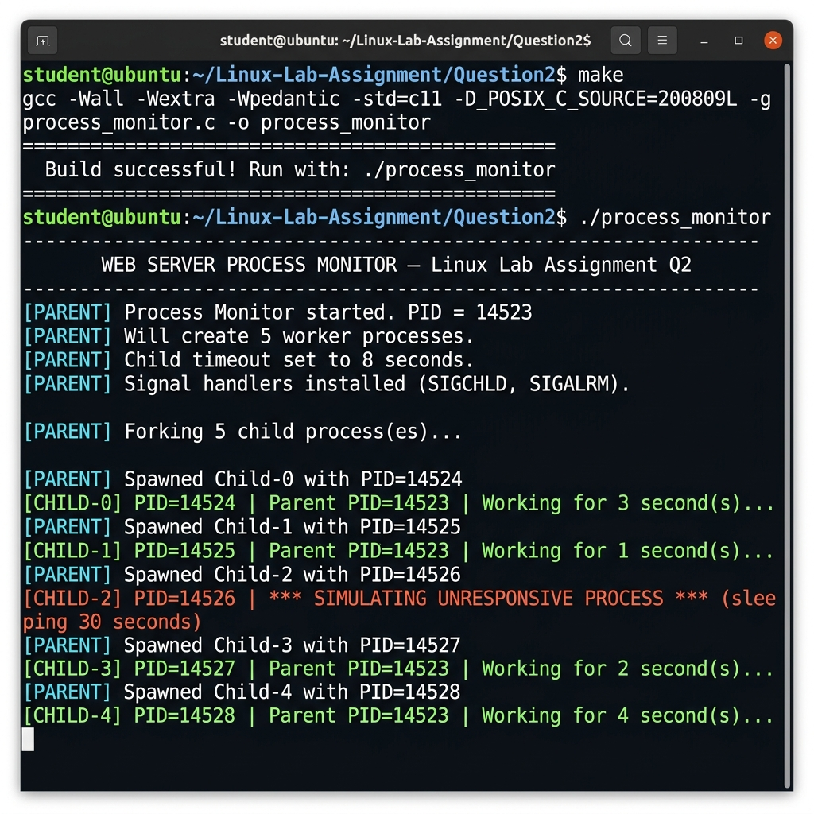
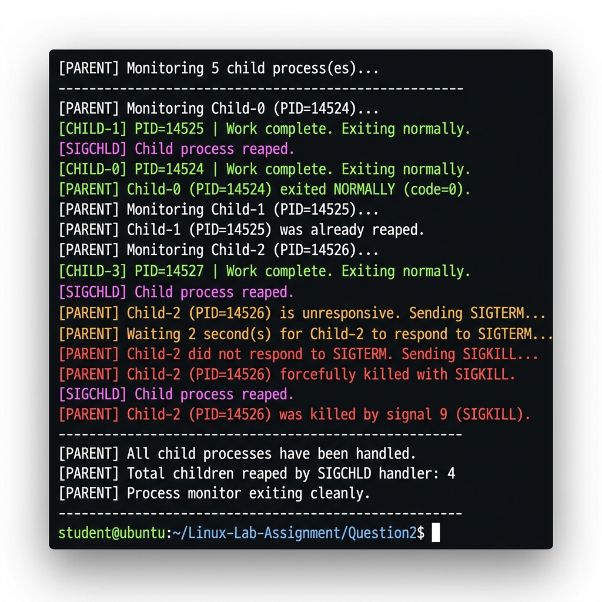

# Screenshots — Question 2
# Process Monitor with Fork, Signals & Zombie Prevention

This folder contains **2 screenshots** captured from compilation and execution of `process_monitor`.

---

## Screenshot 1 — Compilation + Child Process Spawning

**File:** `Screenshot-01-compilation-and-spawn.png`



**What it shows:**
- `make` command running `gcc -Wall -Wextra -Wpedantic -std=c11 -D_POSIX_C_SOURCE=200809L`
- "Build successful!" confirmation message
- `./process_monitor` output — parent process starting (PID shown)
- `[PARENT]` lines in cyan showing 5 child processes being forked
- `[CHILD-0]` through `[CHILD-4]` in green with their PIDs and work durations
- `[CHILD-2]` in **red** — the simulated unresponsive process sleeping for 30 seconds

---

## Screenshot 2 — SIGTERM → SIGKILL Kill Sequence

**File:** `Screenshot-02-sigterm-sigkill.png`



**What it shows:**
- Normal children exiting: `[CHILD-0]`, `[CHILD-1]`, `[CHILD-3]` → "Work complete. Exiting normally."
- `[SIGCHLD]` handler in magenta — automatically reaping finished children
- `[PARENT]` detecting Child-2 is unresponsive → `Sending SIGTERM...` (yellow)
- After timeout: `Child-2 did not respond. Sending SIGKILL...` (red)
- `[PARENT] Child-2 forcefully killed with SIGKILL`
- Final: "All child processes have been handled. Process monitor exiting cleanly."

---

## How to Reproduce These Screenshots

```bash
cd Linux-Lab-Assignment/Question2

# Compile
make
# OR: gcc -Wall -Wextra -std=c11 -D_POSIX_C_SOURCE=200809L process_monitor.c -o process_monitor

# Run (takes ~10 seconds — wait for timeout + SIGKILL phase)
./process_monitor
```

> The program runs for approximately 8–10 seconds before all children are cleaned up.

Use `Cmd + Shift + 4` (macOS) or `scrot` (Linux) to capture.
