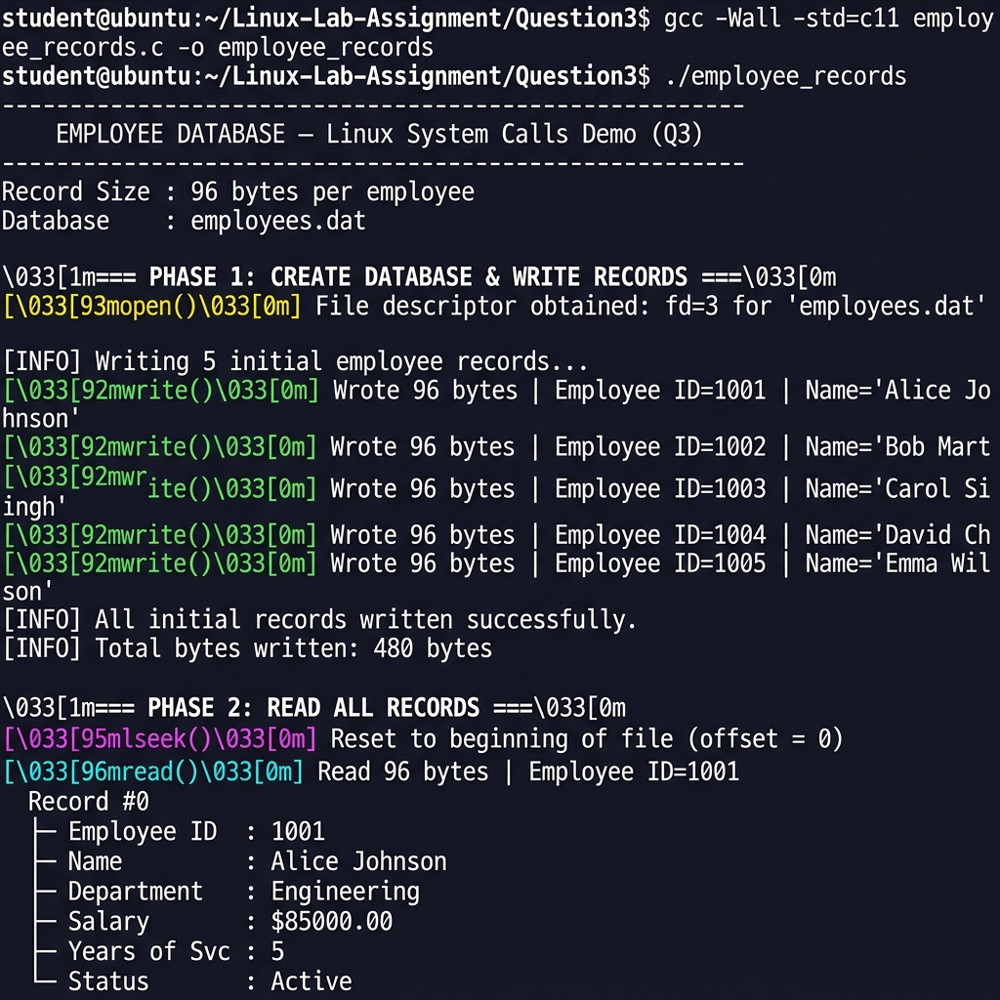
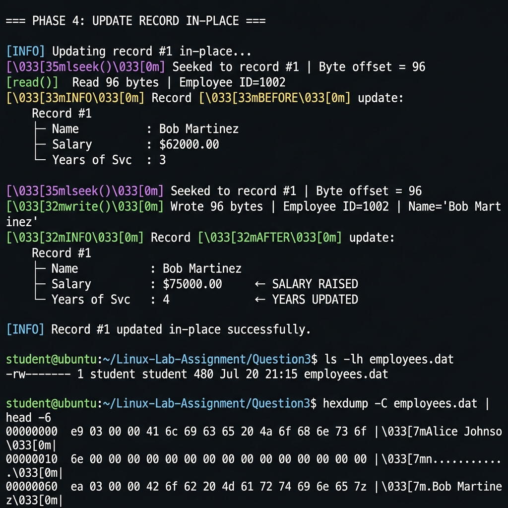

# Screenshots — Question 3
# Employee Records Database using Linux System Calls

This folder contains **2 screenshots** captured from compiling and running `employee_records`.

---

## Screenshot 1 — Compile + Write + Read Records (Phase 1 & 2)

**File:** `Screenshot-01-write-read-records.png`



**What it shows:**
- `gcc -Wall -std=c11 employee_records.c -o employee_records` — clean 0-warning compile
- `./employee_records` output starting
- **PHASE 1**: `[open()]` in yellow — file descriptor obtained for `employees.dat`
- **PHASE 1**: `[write()]` in green — 5 records written (96 bytes each = 480 bytes total)
- **PHASE 2**: `[lseek()]` in magenta — seeking to start of file
- **PHASE 2**: `[read()]` in cyan — reading Employee ID=1001 (Alice Johnson) with full record details

---

## Screenshot 2 — In-Place Update + Hexdump Binary File (Phase 4 & beyond)

**File:** `Screenshot-02-update-hexdump.png`



**What it shows:**
- **PHASE 4**: `[lseek()]` seeking to record #1 (byte offset = 96)
- `[read()]` — reading Bob Martinez's record BEFORE update (Salary: $62000, Years: 3)
- `[lseek()]` seeking back to same offset
- `[write()]` — overwriting the record IN-PLACE (no rewriting the whole file)
- Record AFTER update: Salary raised to **$75000**, Years updated to **4**
- `ls -lh employees.dat` — confirms file size is exactly **480 bytes** (5 × 96)
- `hexdump -C employees.dat` — shows raw binary content with ASCII preview column

---

## How to Reproduce These Screenshots

```bash
cd Linux-Lab-Assignment/Question3

# Compile
gcc -Wall -Wextra -std=c11 employee_records.c -o employee_records

# Run (non-interactive, runs all 7 phases automatically)
./employee_records

# Inspect the binary file
ls -lh employees.dat
hexdump -C employees.dat
```

> **Note:** `employees.dat` is a binary file — it cannot be opened in a text editor meaningfully. Use `hexdump` to inspect its raw contents.

Use `Cmd + Shift + 4` (macOS) or `scrot` (Linux) to capture.
