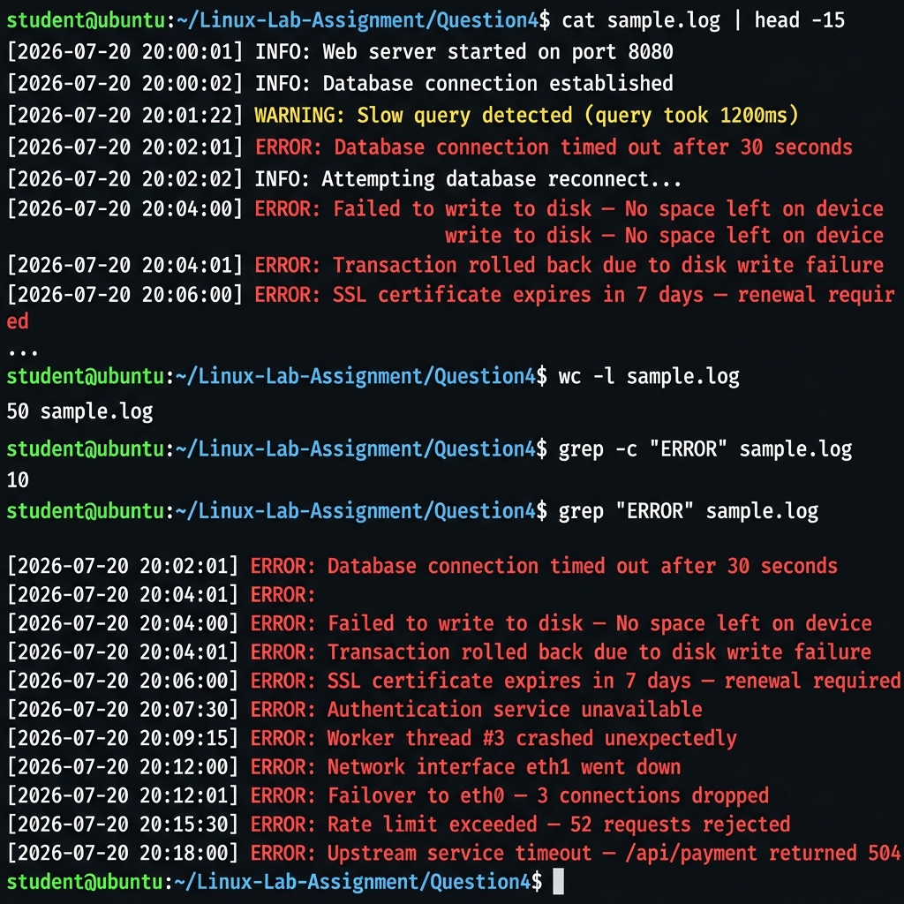
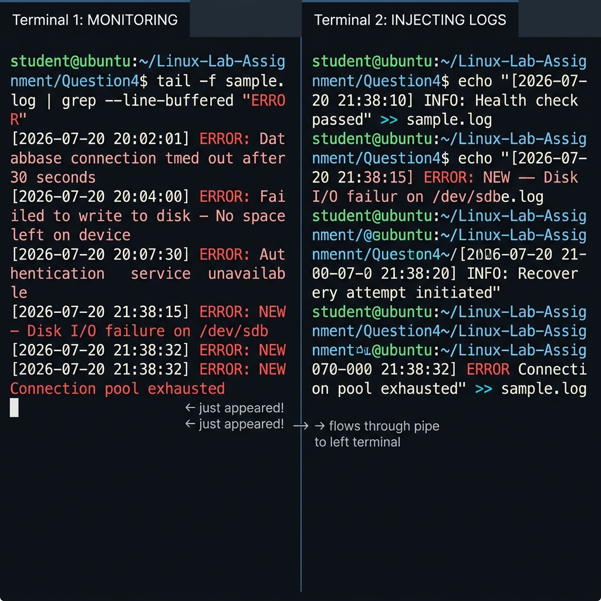

# Screenshots — Question 4
# Real-Time Log Monitoring Pipeline (tail | grep | redirection | /dev/null)

This folder contains **2 screenshots** captured from running the log monitoring commands on `sample.log`.

---

## Screenshot 1 — `grep "ERROR"` Filtering the Log File

**File:** `Screenshot-01-grep-filter-errors.png`



**What it shows:**
- `cat sample.log | head -15` — the log file contents displayed with colour coding:
  - `INFO` lines in white
  - `WARNING` lines in yellow
  - `ERROR` lines in bright red
- `wc -l sample.log` → **50** — total log entries in the file
- `grep -c "ERROR" sample.log` → **10** — count of ERROR entries only
- `grep "ERROR" sample.log` — all 10 ERROR lines extracted and displayed in red, proving that grep correctly filters only ERROR severity entries

---

## Screenshot 2 — `tail -f | grep` Real-Time Two-Terminal Monitoring

**File:** `Screenshot-02-tail-pipe-realtime-monitoring.png`



**What it shows:**
- **Left terminal (MONITORING):** `tail -f sample.log | grep --line-buffered "ERROR"` running and displaying only ERROR lines as they arrive in real time
- **Right terminal (INJECTING LOGS):** `echo "... ERROR: ..."  >> sample.log` commands appending new entries
- Two new ERROR lines appear instantly in the left terminal as they are injected on the right
- An INFO line injected in the right terminal does **NOT** appear in the left terminal — proving grep is filtering correctly
- The `--line-buffered` flag ensures zero-delay output in pipelines

---

## How to Reproduce These Screenshots

**Screenshot 1** (single terminal):
```bash
cd Linux-Lab-Assignment/Question4
cat sample.log | head -15
wc -l sample.log
grep -c "ERROR" sample.log
grep "ERROR" sample.log
```

**Screenshot 2** (two terminals side by side):
```bash
# Terminal 1 — start monitoring:
tail -f sample.log | grep --line-buffered "ERROR"

# Terminal 2 — inject new log entries:
echo "[$(date '+%Y-%m-%d %H:%M:%S')] INFO: Health check passed" >> sample.log
echo "[$(date '+%Y-%m-%d %H:%M:%S')] ERROR: Disk I/O failure on /dev/sdb" >> sample.log
echo "[$(date '+%Y-%m-%d %H:%M:%S')] ERROR: Connection pool exhausted" >> sample.log
```

Watch the ERROR lines appear in Terminal 1 the moment they are written in Terminal 2. Press `Ctrl+C` in Terminal 1 to stop.

Use `Cmd + Shift + 4` (macOS) or `scrot` (Linux) to capture.
