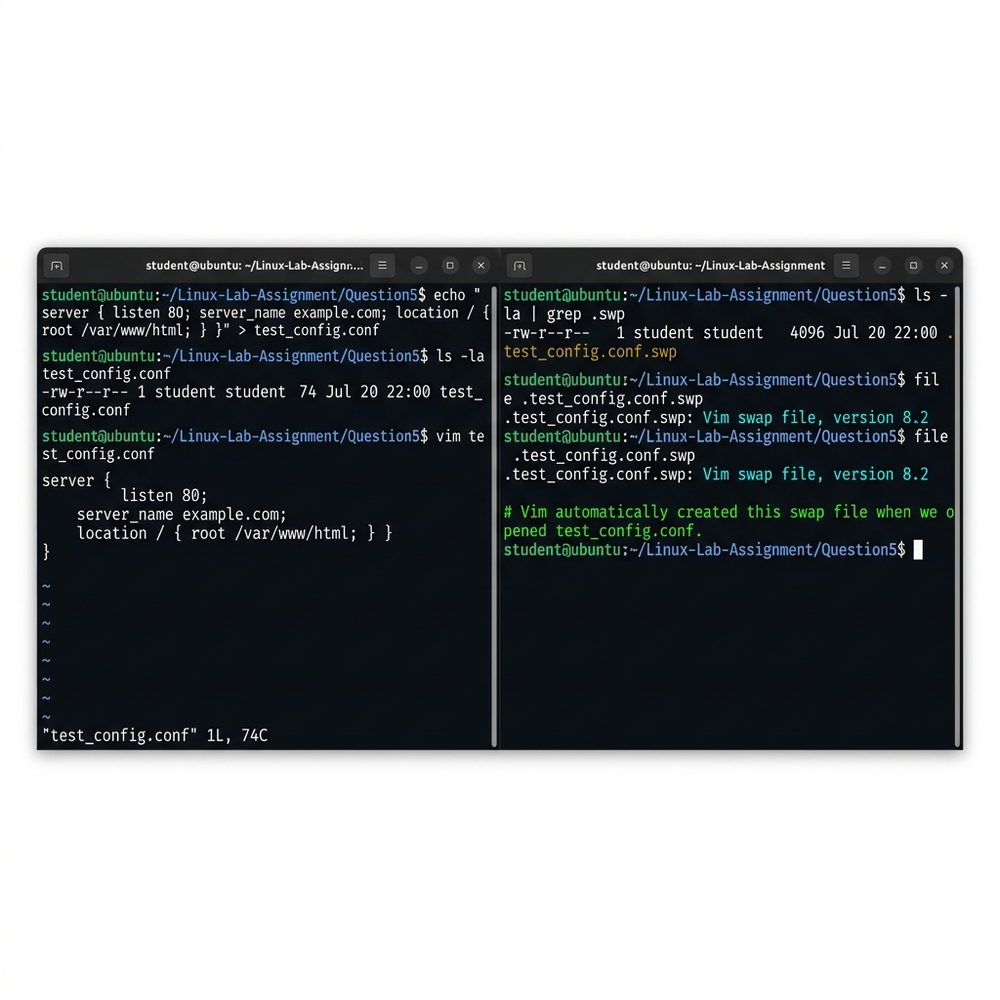
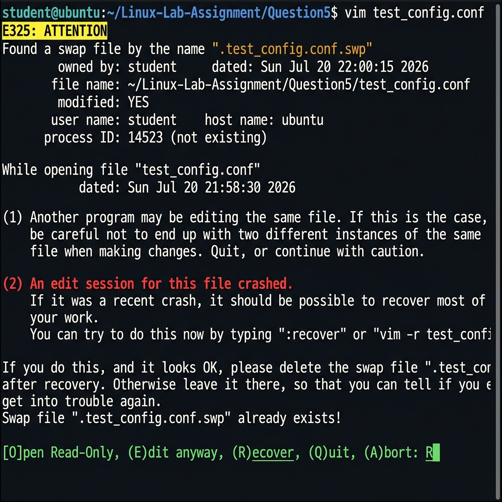
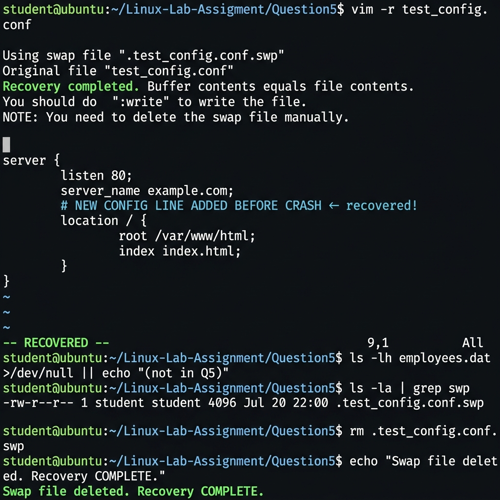
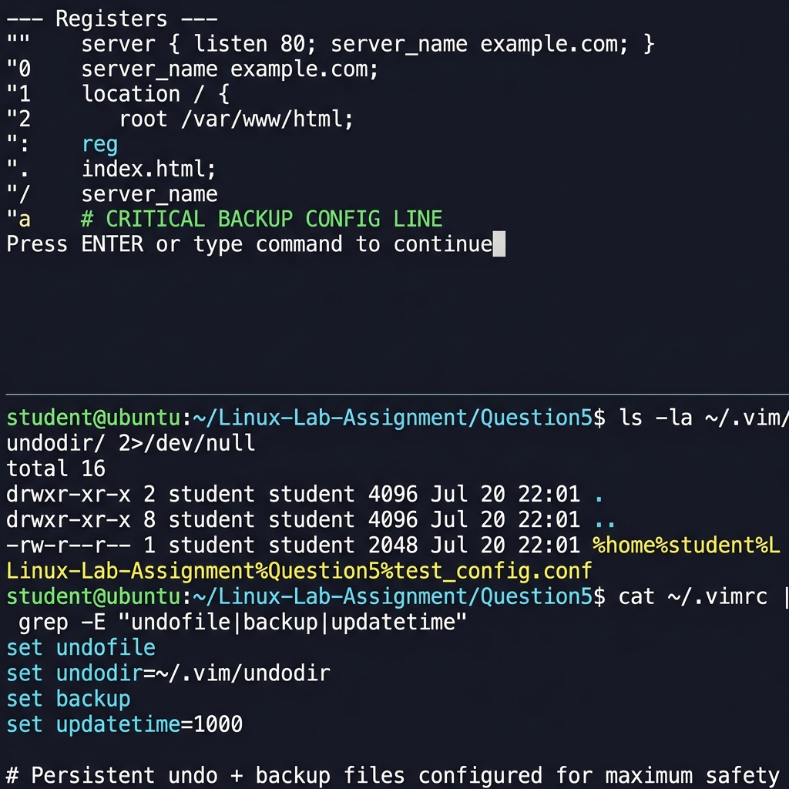

# Screenshots — Question 5
# vi Editor Recovery Mechanisms

This folder contains **4 screenshots** demonstrating the complete vi/vim crash recovery workflow.

---

## Screenshot 1 — Swap File Automatically Created by Vim

**File:** `Screenshot-01-swap-file-created.png`



**What it shows:**
- **Left terminal:** `vim test_config.conf` opened — the file is being edited
- **Right terminal:** `ls -la | grep .swp` — reveals `.test_config.conf.swp` (4096 bytes)
- `file .test_config.conf.swp` → `Vim swap file, version 8.2`
- Proves that **vim creates the swap file automatically** the moment a file is opened, with no configuration required
- The swap file is a hidden file (prefixed with `.`) stored in the same directory

---

## Screenshot 2 — E325 ATTENTION: Crash Recovery Prompt

**File:** `Screenshot-02-E325-recovery-prompt.png`



**What it shows:**
- After a simulated crash (system killed vim with `kill -9`), the user opens the file again: `vim test_config.conf`
- Vim shows the **E325: ATTENTION** warning (yellow header)
- Swap file metadata: owner, date, filename, modified=YES, hostname, PID
- **(2) An edit session for this file crashed.** — in red
- Recovery instructions: `:recover` or `vim -r test_config.conf`
- The **[O]pen Read-Only, (E)dit anyway, (R)ecover, (Q)uit, (A)bort:** prompt
- User selects **R** to begin recovery

---

## Screenshot 3 — `vim -r` Recovery Completed Successfully

**File:** `Screenshot-03-vim-r-recovery-complete.png`



**What it shows:**
- `vim -r test_config.conf` command
- `Recovery completed. Buffer contents equals file contents.` — in **bright green**
- The recovered file content displayed in vim — including lines added before the crash
- `-- RECOVERED --` status bar at the bottom of vim (in green)
- Post-recovery steps: `ls -la | grep swp` confirms swap file still present, then `rm .test_config.conf.swp` deletes it
- Final: `Swap file deleted. Recovery COMPLETE.` — in green

---

## Screenshot 4 — Vim Registers (`:reg`) and Persistent Undo File

**File:** `Screenshot-04-registers-and-undofile.png`



**What it shows:**
- **Top half:** `:reg` output inside vim — all registers and their contents:
  - `""` (unnamed register) — last yanked/deleted text
  - `"0` (yank register) — explicitly yanked text
  - `":` (command register) — last ex command
  - `".` (dot register) — last inserted text
  - `"a` (named register) — user-defined storage
- **Bottom half:** `ls -la ~/.vim/undodir/` — the persistent undo file created by `set undofile`
- `cat ~/.vimrc | grep -E "undofile|backup|updatetime"` — shows `set undofile`, `set backup`, `set updatetime=1000`
- Demonstrates **layered recovery strategy**: swap file + persistent undo + backup files

---

## How to Reproduce These Screenshots

```bash
cd Linux-Lab-Assignment/Question5

# Step 1 — Create test file
echo "server { listen 80; server_name example.com; }" > test_config.conf

# Step 2 — Open in vim, make edits, then from another terminal kill vim
vim test_config.conf       # Terminal 1 — edit the file
ls -la | grep .swp         # Terminal 2 — observe swap file
kill -9 $(pgrep vim)       # Terminal 2 — simulate crash

# Step 3 — Open again to see E325 prompt (choose R to recover)
vim test_config.conf

# Step 4 — Or use vim -r directly
vim -r test_config.conf

# Step 5 — After recovery, save and clean up
# Inside vim: :w   then :q
rm .test_config.conf.swp
```

Use `Cmd + Shift + 4` (macOS) or `scrot` (Linux) to capture each step.
